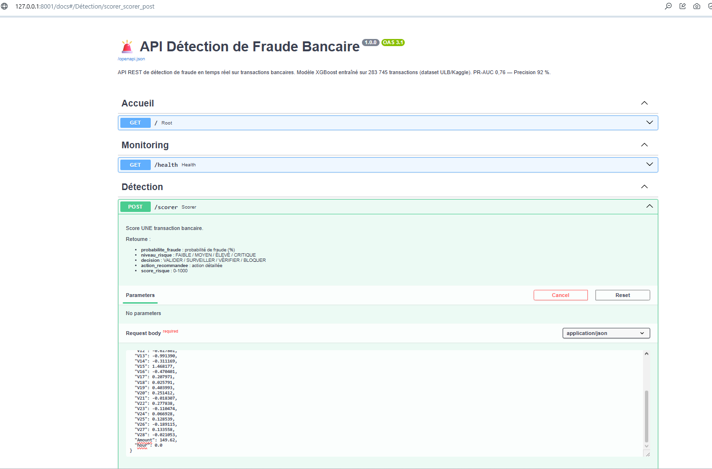
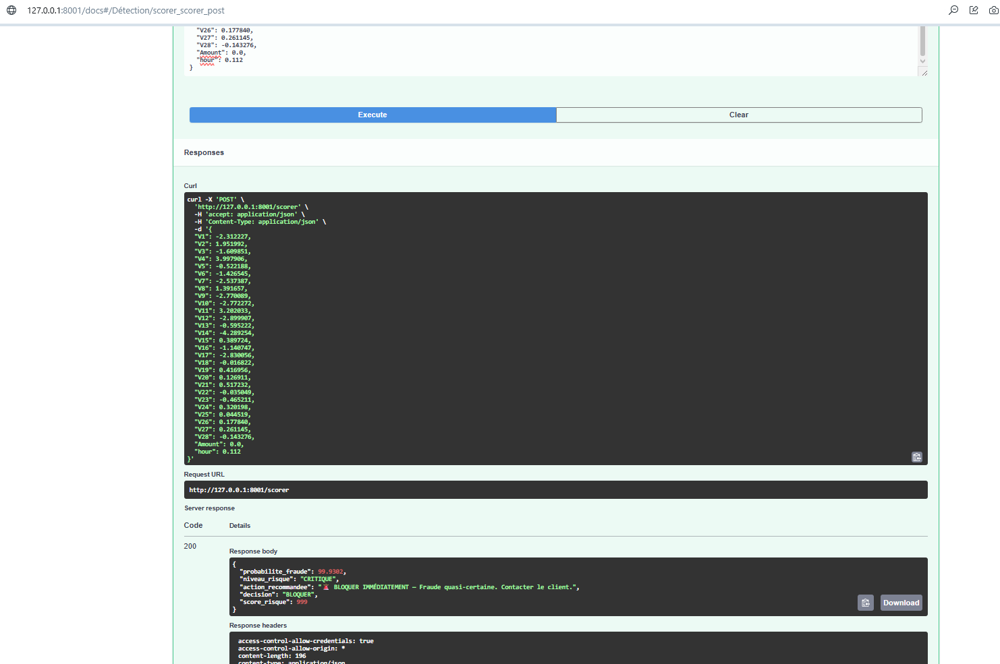
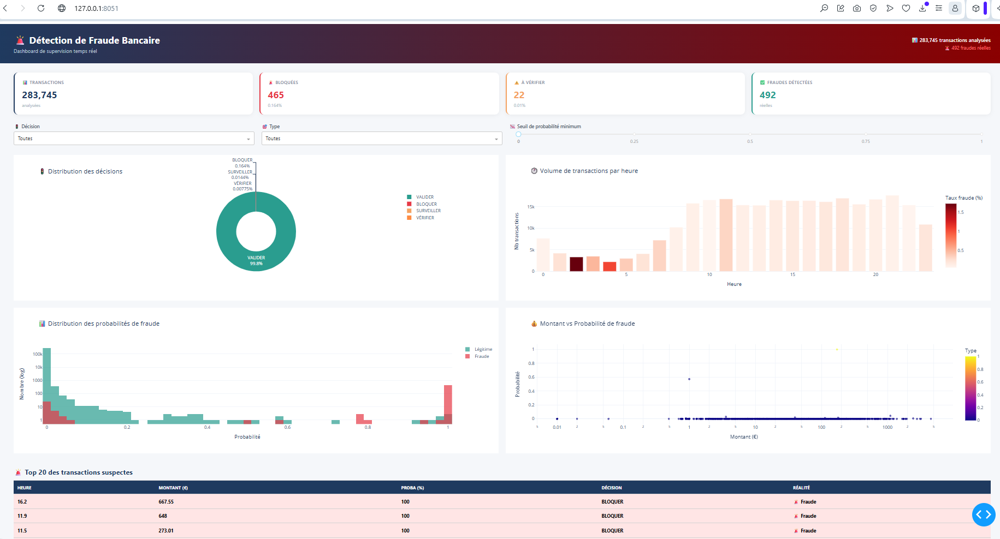
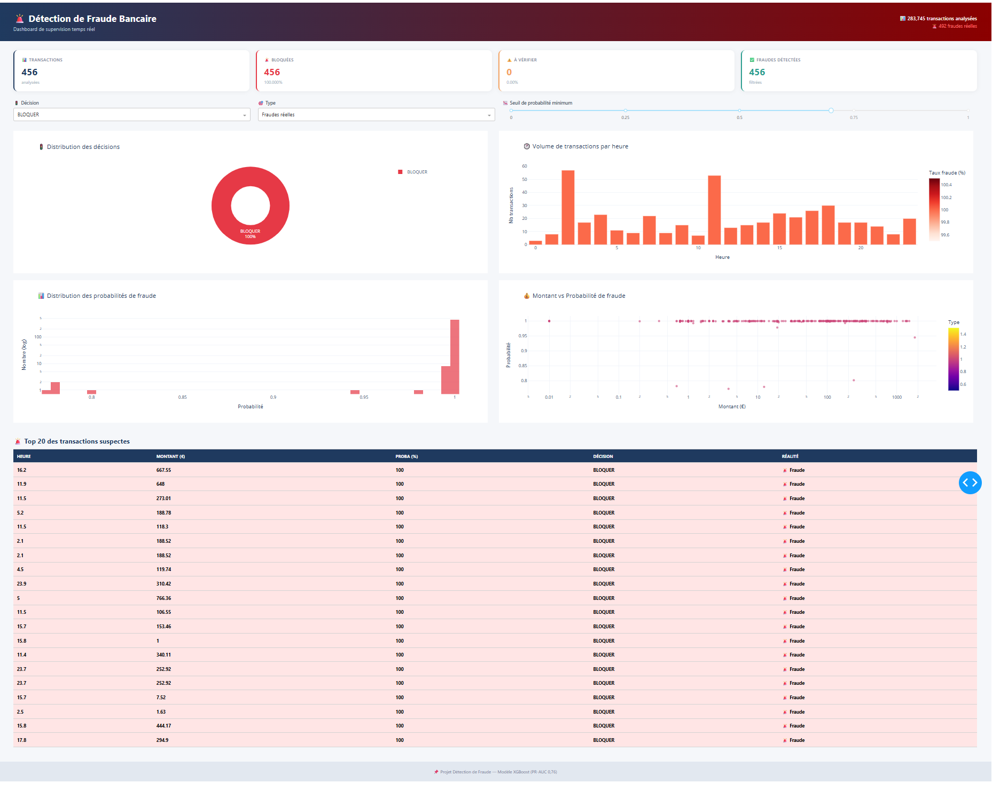
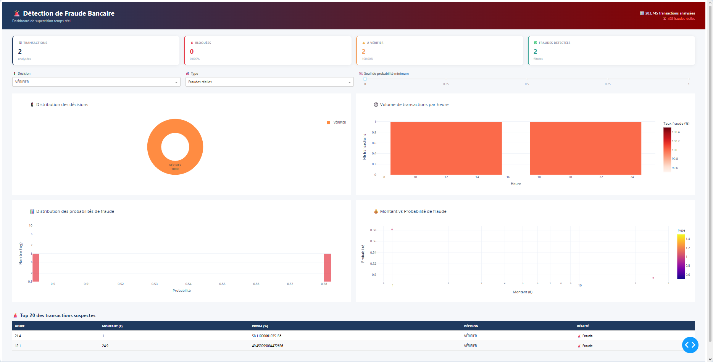

# 🚨 Détection de Fraude Bancaire — Machine Learning

[](https://www.python.org/)
[](https://pandas.pydata.org/)
[](https://scikit-learn.org/)
[](https://xgboost.readthedocs.io/)
[](https://fastapi.tiangolo.com/)
[](https://plotly.com/)
[](https://dash.plotly.com/)
[](LICENSE)

> Système complet de détection de fraude bancaire par Machine Learning — modèle XGBoost entraîné sur **283 745 transactions**, API REST temps réel et dashboard de supervision.

---

## 🎯 Objectif

Construire un **système de détection de fraude en temps réel** capable de :
- **Détecter** les transactions frauduleuses avec un haut niveau de précision
- **Minimiser** les faux positifs (frictions clients)
- **Exposer** un scoring en temps réel via une API REST
- **Fournir** un dashboard de supervision pour le comité fraude

---

## 📊 Résultats clés

| Indicateur | Valeur |
|-----------|--------|
| 📥 Transactions analysées | **283 745** |
| 🚨 Fraudes réelles | **492** (0,1734 %) |
| ⚖️ Ratio de déséquilibre | **1:578** |
| 🎯 **PR-AUC** (métrique clé) | **0,7624** |
| 🎯 ROC-AUC | 0,9729 |
| 🎯 **Precision** | **91,67 %** |
| 🎯 Recall | 71,54 % |
| 🎯 F1-score | 80,37 % |
| ❌ Faux positifs | **8** sur 283 253 légitimes (0,003 %) |

### 🏆 Performance sur les 492 fraudes réelles

| Décision | Nb fraudes | % | Statut |
|----------|-----------|---|--------|
| 🚨 **BLOQUER** | **456** | **92,7 %** | Détection automatique |
| ⚠️ **VÉRIFIER** | 2 | 0,4 % | Vérification manuelle |
| 👀 **SURVEILLER** | 34 | 6,9 % | Surveillance passive |
| ✅ **VALIDER** | **0** | **0 %** | **Aucune fraude ignorée** |

> **Résultat clé** : aucune fraude n'est validée automatiquement. Le système ne laisse passer **aucune fraude** sans contrôle.

---

## 📈 Insights de l'analyse exploratoire

### 🕐 La fraude frappe la NUIT

| Moment | Taux de fraude | vs moyenne |
|--------|---------------|------------|
| 🌙 **Nuit (0-6h)** | **0,520 %** | **× 3** |
| Matin (6-12h) | 0,167 % | ~1× |
| Après-midi (12-18h) | 0,139 % | < 1× |
| Soir (18-24h) | 0,125 % | < 1× |

Les fraudeurs opèrent **entre 2h et 4h du matin**, quand la surveillance est minimale.

### 🎯 Top 5 features discriminantes (Cohen's d)

| Rang | Feature | Cohen's d |
|------|---------|-----------|
| 1 | V14 | 2,259 |
| 2 | V4 | 2,015 |
| 3 | V11 | 1,882 |
| 4 | V12 | 1,867 |
| 5 | V10 | 1,606 |

### 💸 La fraude aime les PETITS montants

| Tranche | Taux de fraude |
|---------|---------------|
| **< 1 €** | **0,597 %** |
| 1-10 € | 0,098 % |
| 10-100 € | 0,089 % |
| 100-1000 € | 0,226 % |
| > 1000 € | 0,307 % |

**Interprétation** : les fraudeurs **testent** les cartes avec des micro-transactions avant les gros achats.

---

## 🤖 Modèle de détection

### Approche technique

| Aspect | Décision |
|--------|----------|
| **Déséquilibre** | SMOTE pour Logistic + `scale_pos_weight` natif pour XGBoost |
| **Split** | 75 % / 25 % stratifié |
| **Métrique clé** | **PR-AUC** (pas d'accuracy — trompeuse) |
| **Features** | V1-V28 (PCA) + Amount + hour |
| **Seuils décision** | BLOQUER ≥ 0,7 / VÉRIFIER ≥ 0,3 / SURVEILLER ≥ 0,1 |

### Comparaison des modèles

| Modèle | PR-AUC | ROC-AUC | Precision | Recall | Faux positifs |
|--------|--------|---------|-----------|--------|---------------|
| Logistic Regression | 0,626 | 0,967 | 0,063 | 0,837 | 1 538 |
| Random Forest | 0,738 | 0,952 | 0,856 | 0,675 | 14 |
| **XGBoost** 🏆 | **0,762** | **0,973** | **0,917** | 0,715 | **8** |

**XGBoost = meilleur compromis** : meilleure précision + moins de faux positifs.

### Optimisation du seuil de décision

| Seuil | Precision | Recall | F1 | Faux positifs | Faux négatifs |
|-------|-----------|--------|-----|---------------|---------------|
| 0,1 | 0,754 | 0,724 | 0,739 | 29 | 34 |
| 0,3 | 0,848 | 0,724 | 0,781 | 16 | 34 |
| 0,5 | 0,917 | 0,715 | 0,804 | 8 | 35 |
| **0,7** | **0,936** | 0,707 | **0,806** | **6** | 36 |

**Choix business** : seuil 0,7 privilégie la précision (moins de clients bloqués à tort).

---

## 🛠️ Architecture du projet

```
fraud-detection-ml/
├── data/
│   ├── raw/                         # Dataset Kaggle (non versionné)
│   └── processed/
│       └── transactions_clean.csv
├── models/
│   └── fraud_model.pkl              # Modèle XGBoost entraîné
├── src/
│   ├── data_loader.py               # Étape 1 : Diagnostic
│   ├── cleaning.py                  # Étape 2 : Nettoyage
│   ├── eda.py                       # Étape 3 : Analyse exploratoire
│   └── fraud_model.py               # Étape 4 : Modélisation ML
├── api/
│   ├── schemas.py                   # Schémas Pydantic
│   └── main.py                      # API REST FastAPI
├── dashboard/
│   └── app.py                       # Dashboard Dash
├── reports/
│   ├── eda/                         # 8 graphiques HTML
│   └── screenshots/                 # Captures d'écran
├── requirements.txt
└── README.md
```

---

## 🚀 Installation & Lancement

### 1. Cloner le projet

```bash
git clone https://github.com/bisneldev/fraud-detection-ml.git
cd fraud-detection-ml
```

### 2. Créer l'environnement virtuel

```bash
python -m venv venv

# Windows
venv\Scripts\activate

# macOS / Linux
source venv/bin/activate
```

### 3. Installer les dépendances

```bash
pip install -r requirements.txt
```

### 4. Télécharger le dataset

Le dataset **Credit Card Fraud Detection** (ULB Machine Learning Group) n'est pas inclus dans le repo (150 Mo).

1. Télécharge-le sur : https://www.kaggle.com/datasets/mlg-ulb/creditcardfraud
2. Place le fichier `creditcard.csv` dans `data/raw/`

### 5. Exécuter le pipeline complet

```bash
# Étape 1 : Chargement + Diagnostic
python src/data_loader.py

# Étape 2 : Nettoyage (doublons + features)
python src/cleaning.py

# Étape 3 : Analyse exploratoire (8 graphiques HTML)
python src/eda.py

# Étape 4 : Entraînement des modèles ML
python src/fraud_model.py
```

### 6. Lancer l'API REST

```bash
python -m api.main
```
→ API : http://127.0.0.1:8001
→ Documentation Swagger : http://127.0.0.1:8001/docs

### 7. Lancer le dashboard de supervision

```bash
python dashboard/app.py
```
→ Dashboard : http://127.0.0.1:8051

---

## 📡 API REST — Endpoints

| Méthode | Endpoint | Description |
|---------|----------|-------------|
| `GET` | `/` | Page d'accueil |
| `GET` | `/health` | État de l'API |
| `POST` | `/scorer` | **Scorer une transaction** |
| `POST` | `/scorer/batch` | Scorer plusieurs transactions (max 1000) |
| `GET` | `/seuils` | Voir les seuils de décision |
| `GET` | `/modele/info` | Informations sur le modèle |
| `GET` | `/docs` | Documentation Swagger UI |

### Exemple d'appel `/scorer`

**Transaction légitime** :
```bash
curl -X POST http://127.0.0.1:8001/scorer \
  -H "Content-Type: application/json" \
  -d '{
    "V1": -1.359807, "V2": -0.072781, "V3": 2.536347,
    "V4": 1.378155, "V5": -0.338321, "V6": 0.462388,
    "V7": 0.239599, "V8": 0.098698, "V9": 0.363787,
    "V10": 0.090794, "V11": -0.551600, "V12": -0.617801,
    "V13": -0.991390, "V14": -0.311169, "V15": 1.468177,
    "V16": -0.470401, "V17": 0.207971, "V18": 0.025791,
    "V19": 0.403993, "V20": 0.251412, "V21": -0.018307,
    "V22": 0.277838, "V23": -0.110474, "V24": 0.066928,
    "V25": 0.128539, "V26": -0.189115, "V27": 0.133558,
    "V28": -0.021053, "Amount": 149.62, "hour": 0.0
  }'
```

**Réponse** :
```json
{
  "probabilite_fraude": 0.0034,
  "niveau_risque": "FAIBLE",
  "action_recommandee": "✅ VALIDER — Transaction conforme au comportement normal.",
  "decision": "VALIDER",
  "score_risque": 0
}
```

**Fraude détectée** :
```json
{
  "probabilite_fraude": 99.9302,
  "niveau_risque": "CRITIQUE",
  "action_recommandee": "🚨 BLOQUER IMMÉDIATEMENT — Fraude quasi-certaine.",
  "decision": "BLOQUER",
  "score_risque": 999
}
```

---

## 📸 Aperçus

### API REST — Swagger UI


### Détection d'une fraude en temps réel


### Dashboard — Vue globale


### Focus : 456 fraudes bloquées automatiquement


### Focus : fraudes ambiguës en vérification


---

## 🔬 Stack technique

| Domaine | Outils |
|---------|--------|
| **Langage** | Python 3.10+ |
| **Data** | Pandas, NumPy |
| **ML** | Scikit-learn, XGBoost, imbalanced-learn (SMOTE) |
| **Visualisation** | Plotly Express, Plotly Graph Objects |
| **Dashboard** | Dash |
| **API** | FastAPI, Uvicorn, Pydantic |
| **Sérialisation** | Joblib |

---

## 🗺️ Roadmap

- [x] Étape 1 — Diagnostic du dataset (284 807 transactions)
- [x] Étape 2 — Nettoyage (doublons, features)
- [x] Étape 3 — Analyse exploratoire (8 graphiques)
- [x] Étape 4 — Modélisation ML (XGBoost, PR-AUC 0,76)
- [x] Étape 5 — API REST FastAPI (temps réel)
- [x] Étape 6 — Dashboard de supervision
- [ ] Étape 7 — Déploiement cloud (Docker + AWS/GCP)
- [ ] Étape 8 — Intégration Kafka pour streaming temps réel

---

## 💼 Cas d'usage bancaire

Ce projet répond à des **besoins réels** d'une banque :

1. **Direction des Risques** → réduction des pertes frauduleuses
2. **Service Fraude** → priorisation des alertes à vérifier
3. **DSI** → API intégrable au SI existant
4. **Conformité** → traçabilité des décisions de blocage
5. **Relation Client** → réduction des frictions (peu de faux positifs)

---

## 📊 Comparaison avec mon autre projet

Ce projet est **complémentaire** de mon projet d'analyse du risque crédit :

| Projet | Domaine | Objectif |
|--------|---------|----------|
| 🏦 [credit-risk-gabon](https://github.com/bisneldev/credit-risk-gabon) | Risque CRÉDIT | Prédire si un client va faire défaut |
| 🚨 **fraud-detection-ml** | Risque FRAUDE | Détecter une transaction frauduleuse |

**Ensemble** = vue complète du Risk Management bancaire.

---

## 👤 Auteur

**Bisneldev**
- 🎓 Ingénierie Financière — Sciences et Techniques Comptables et Financières
- 💼 Finance, Audit, Contrôle de gestion + Développement d'applications
- 📍 Libreville, Gabon
- 📧 [ton.email@example.com](mailto:bisneldev@gmail.com)
- 💼 [LinkedIn](https://www.linkedin.com/in/bisnel-nzamba)
- 🐙 [GitHub](https://github.com/bisneldev)

---

## 📄 Licence

Ce projet est sous licence MIT — voir le fichier [LICENSE](LICENSE) pour plus de détails.

---

⭐ **Si ce projet vous intéresse, n'hésitez pas à laisser une étoile !**